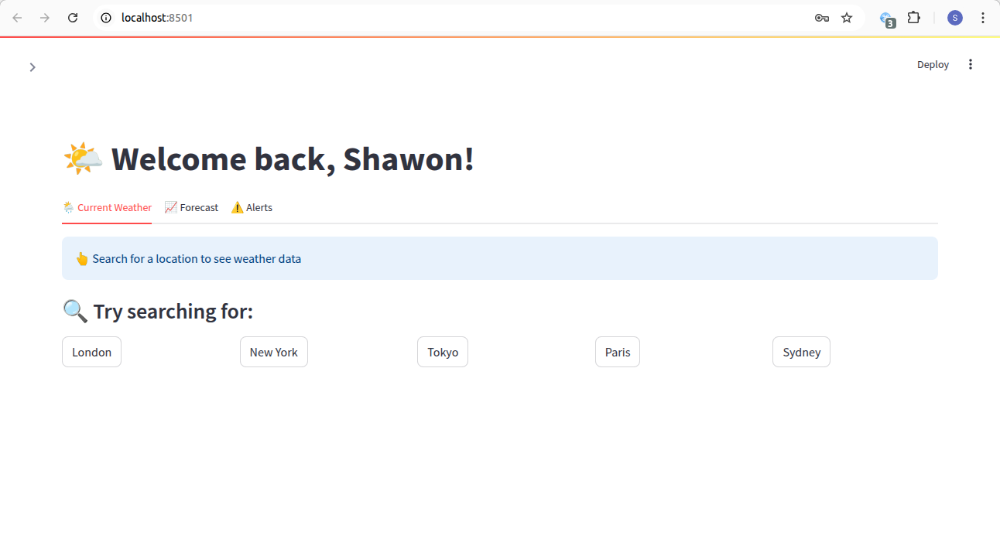
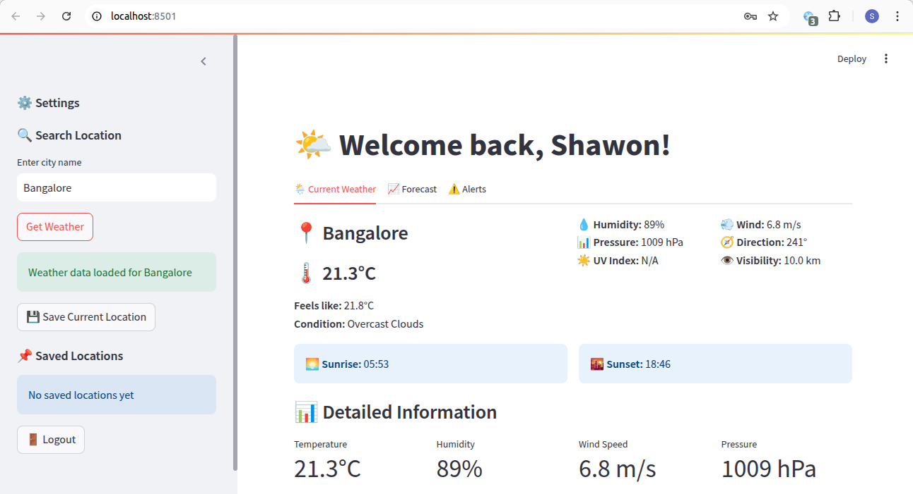
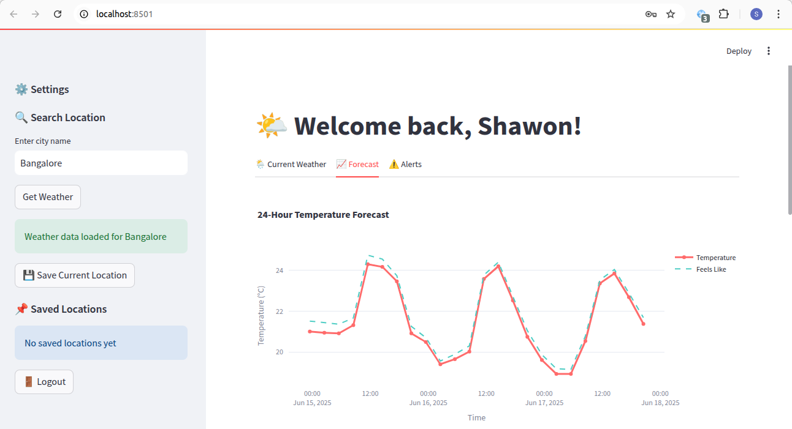
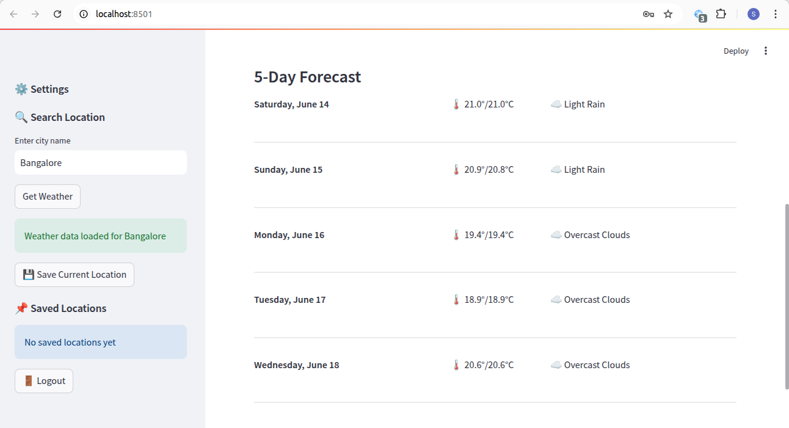
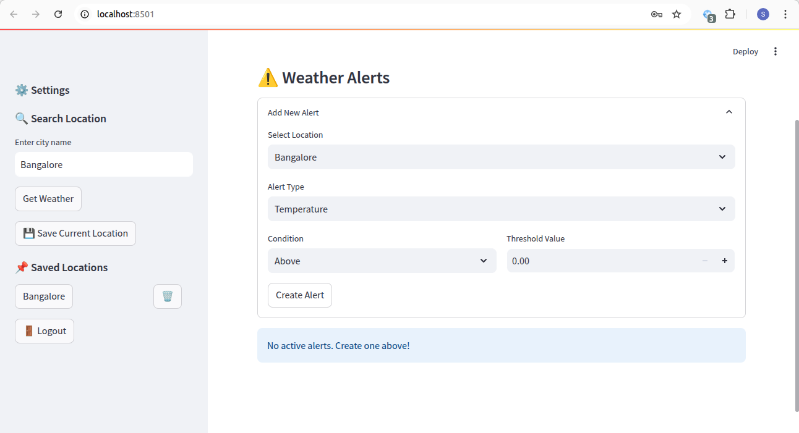
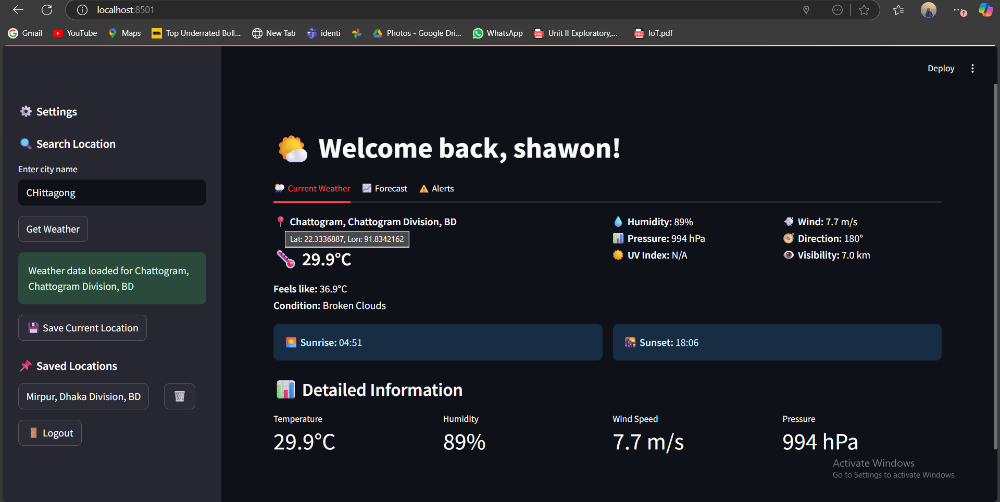

# WeatherPro

A modern weather application built with Streamlit that provides real-time weather information and forecasts.

## Features

- Real-time weather data from OpenWeatherMap API
- Interactive weather visualization using Plotly
- User-friendly interface with Streamlit
- Historical weather data analysis
- Weather forecasting capabilities

## Prerequisites

- Python 3.8 or higher
- Internet connection for API access

## Installation

1. Clone the repository
2. Install dependencies:
   ```bash
   pip install -r requirements.txt
   ```

## Configuration

1. Create a `.env` file in the root directory with your OpenWeatherMap API key:
   ```
   OPENWEATHER_API_KEY=your_api_key_here
   ```

2. The backend server runs on `http://localhost:8080` by default

## Running the Application

1. Start the backend server (if not already running)
2. Run the Streamlit app:
   ```bash
   streamlit run client/app.py
   ```

The application will be available at `http://localhost:8501`

## Project Structure

```
WeatherPro/
├── client/                 # Frontend Application
│   ├── app.py
│   └── requirements.txt   # Python dependencies         
├── server/            # Backend Application
│   ├── app/         
│   │   ├── src/      
│   │   │   └── main/
│   │   │       └── java/
│   │   │           └── com/weatherpro/
│   │   │               └── App.java
│   │   └── build.gradle configuration
│   ├── gradle/      
│   └── gradlew     
├── README.md         # Project documentation
└── screenshots/      # Application screenshots
```

## Screenshots









## Technologies Used

- Frontend: Streamlit
- Data Visualization: Plotly
- HTTP Requests: Requests
- Data Processing: Pandas
- Backend: Vert.x with Gradle
- API: OpenWeatherMap

## Backend Architecture

The backend is built using Vert.x, a high-performance reactive framework for the JVM. It's built with Gradle as the build system and runs on port 8080 by default.

### API Integration

#### OpenWeatherMap API
WeatherPro uses the OpenWeatherMap API to fetch weather data. The application makes use of the following OpenWeatherMap endpoints:

1. **Current Weather**
   - Endpoint: `https://api.openweathermap.org/data/2.5/weather`
   - Parameters:
     - `q`: Location name
     - `appid`: API key
     - `units`: Metric (°C)
   - Returns: Current weather conditions including temperature, humidity, wind, etc.

2. **5-Day Forecast**
   - Endpoint: `https://api.openweathermap.org/data/2.5/forecast`
   - Parameters:
     - `lat`: Latitude
     - `lon`: Longitude
     - `appid`: API key
     - `units`: Metric (°C)
   - Returns: 5-day weather forecast with 3-hour intervals

### Backend API Endpoints

#### Authentication

1. **Login**
   - `POST /api/auth/login`
   - Body: { "username": string, "password": string }
   - Returns: { "success": boolean, "user_id": string, "token": string }

2. **Register**
   - `POST /api/auth/register`
   - Body: { "username": string, "email": string, "password": string }
   - Returns: { "success": boolean, "message": string }

#### Location Management

1. **Save Location**
   - `POST /api/locations/save`
   - Body: { "user_id": string, "location": string, "display_name": string }
   - Returns: { "success": boolean, "message": string }

2. **Get User Locations**
   - `GET /api/locations/{user_id}`
   - Returns: { "success": boolean, "locations": array }

#### Weather Alerts

1. **Create Alert**
   - `POST /api/alerts/create`
   - Body: { "user_id": string, "location": string, "alert_type": string, "condition": string, "threshold": number }
   - Returns: { "success": boolean, "message": string }

### API Response Format

All API responses follow this format:
```json
{
  "success": boolean,
  "message": string,
  "data": { /* API-specific data */ }
}
```

## Building the Backend

To build and run the backend server:

1. Navigate to the server directory:
   ```bash
   cd server/app
   ```

2. Build the project:
   ```bash
   ./gradlew build
   ```

3. Run the server:
   ```bash
   ./gradlew run
   ```

The server will start on port 8080 by default.

## License

This project is licensed under the MIT License - see the LICENSE file for details.

## Contributing

1. Fork the repository
2. Create your feature branch (`git checkout -b feature/AmazingFeature`)
3. Commit your changes (`git commit -m 'Add some AmazingFeature'`)
4. Push to the branch (`git push origin feature/AmazingFeature`)
5. Open a Pull Request
